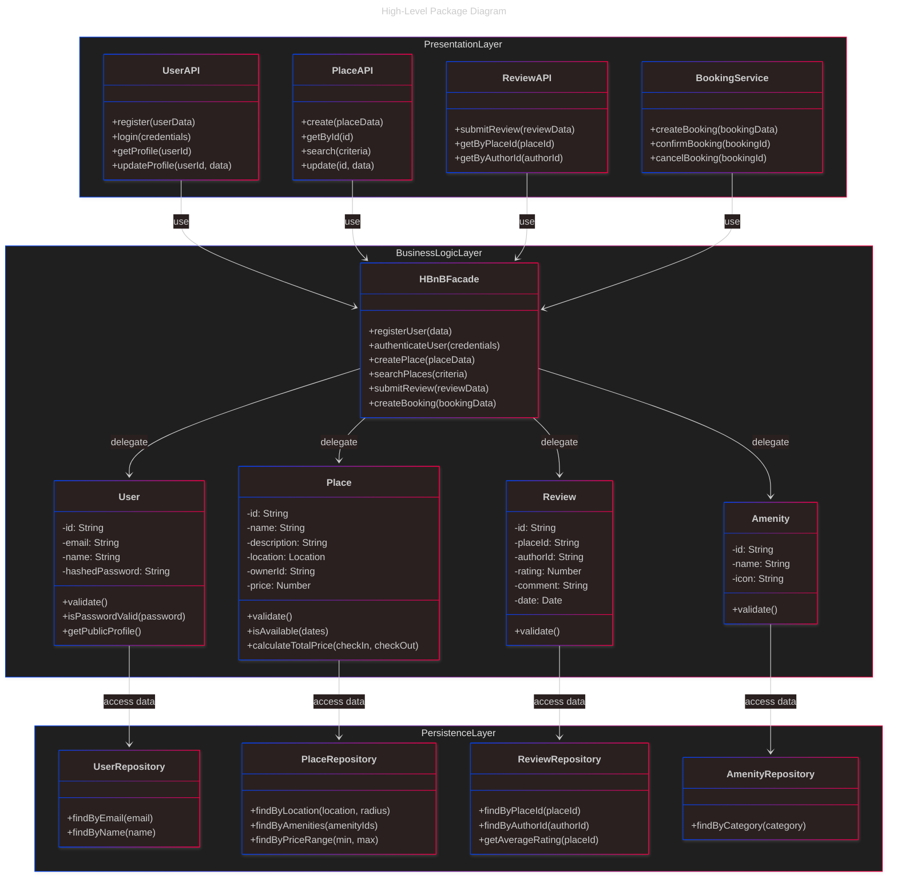
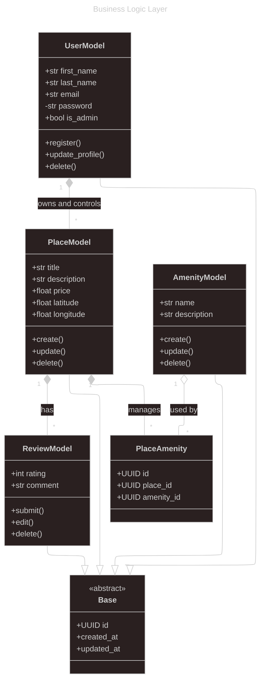
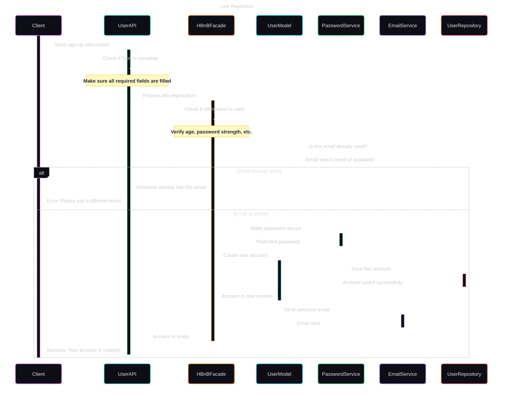
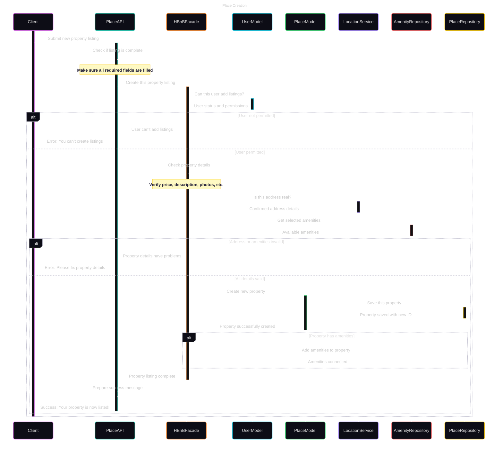
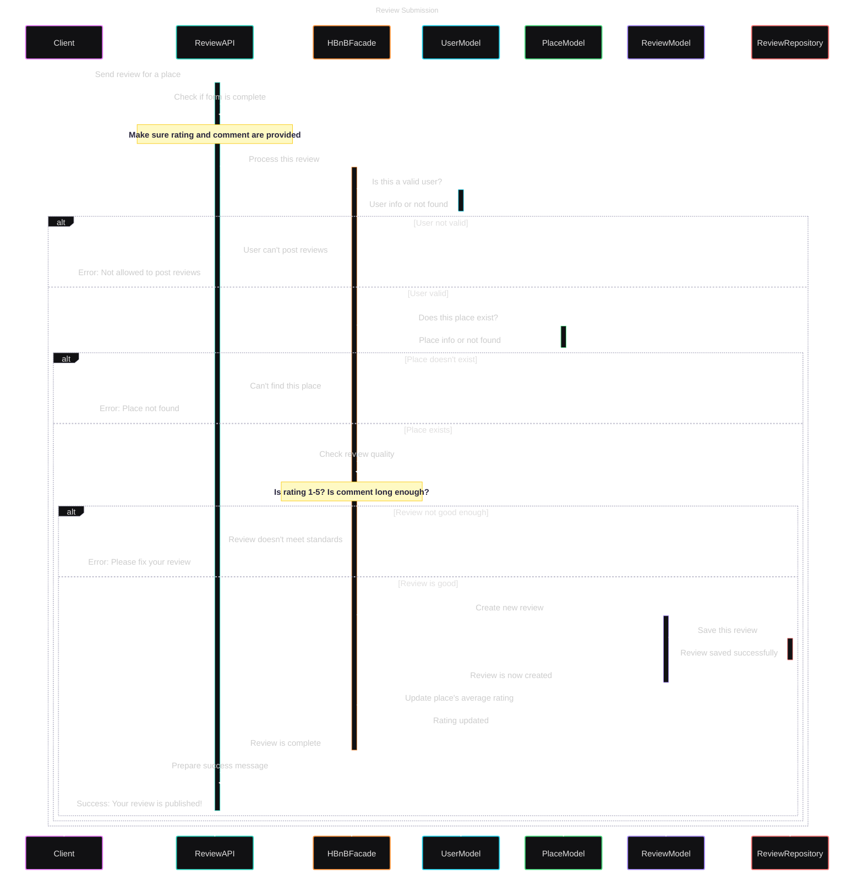

# HBnB Project – Technical Documentation

## 1. Introduction

This technical document presents the architecture of the **HBnB** project, a housing rental platform inspired by Airbnb.

It brings together all the UML diagrams created during the design phases:
- The **package diagram** (layered architecture),
- The **business class diagram** (Business Logic Layer),
- The **sequence diagrams** illustrating API call flows.

This document serves as a **technical reference** for the development phases, ensuring clarity, consistency, and maintainability of the system.

---

## 2. High-Level Architecture

### 2.1 Package Diagram

### 2.2 Description of the Layered Architecture

The system is based on a layered architecture:

- **API Layer (Interface)**: handles REST requests, acts as a facade.
- **Business Logic Layer**: contains business rules (user creation, reviews, etc.)
- **Storage Layer**: interaction with files or database.

This separation allows for good **modularity**, **testability**, and **maintainability** of the code.

---

## 3. Business Logic Layer

### 3.1 Business Class Diagram

### 3.2 Description of Entities and Relationships

#### 🔸 Base
Common abstract class, provides: `id`, `created_at`, `updated_at`.

#### 🔸 User
Represents a user:
- Attributes: `first_name`, `last_name`, `email`, `is_admin`, etc.
- Methods: `register()`, `delete()`, etc.
- Inherits from `Base`.
- **Composition** with `Place`: a `User` owns their `Place`.

#### 🔸 Place
Represents a published accommodation:
- Attributes: `title`, `price`, `latitude`, etc.
- Methods: `create()`, `update()`, etc.
- Composed in `User`, aggregates `Review`.

#### 🔸 Review
Represents a review:
- Attributes: `rating`, `comment`
- Methods: `submit()`, `edit()`
- Linked to `User` and `Place` via simple associations

#### 🔸 Amenity
Represents a facility (Wi-Fi, etc.)
- Associated via `PlaceAmenity`
- Exists independently of `Place`

#### 🔸 PlaceAmenity
Association table between `Place` and `Amenity`
- **Composed in `Place`**
- **Aggregated by `Amenity`**

---

## 4. API Interaction Flow

### 4.1 Sequence Diagrams

Recommended examples:
- Creation of a `Place` by a user
- Writing a `Review`
- Deletion of a user account

### 4.2 Explanation of Scenarios

#### Example: Writing a review

1. The authenticated user submits a review via the API.
2. The API validates authentication and format.
3. The `Review` is created in the business layer.
4. The `Review` is linked to the user and accommodation.
5. The object is saved in the database.

---

## 5. Conclusion

This document constitutes the **technical reference base** for the HBnB project.  
It guides the implementation of the system while respecting business rules, interactions between layers, and design constraints.

---

## 📎 Appendices

- Links to sources (UML guides, style guides)
- Project references or tools used (Mermaid, PlantUML, etc.)