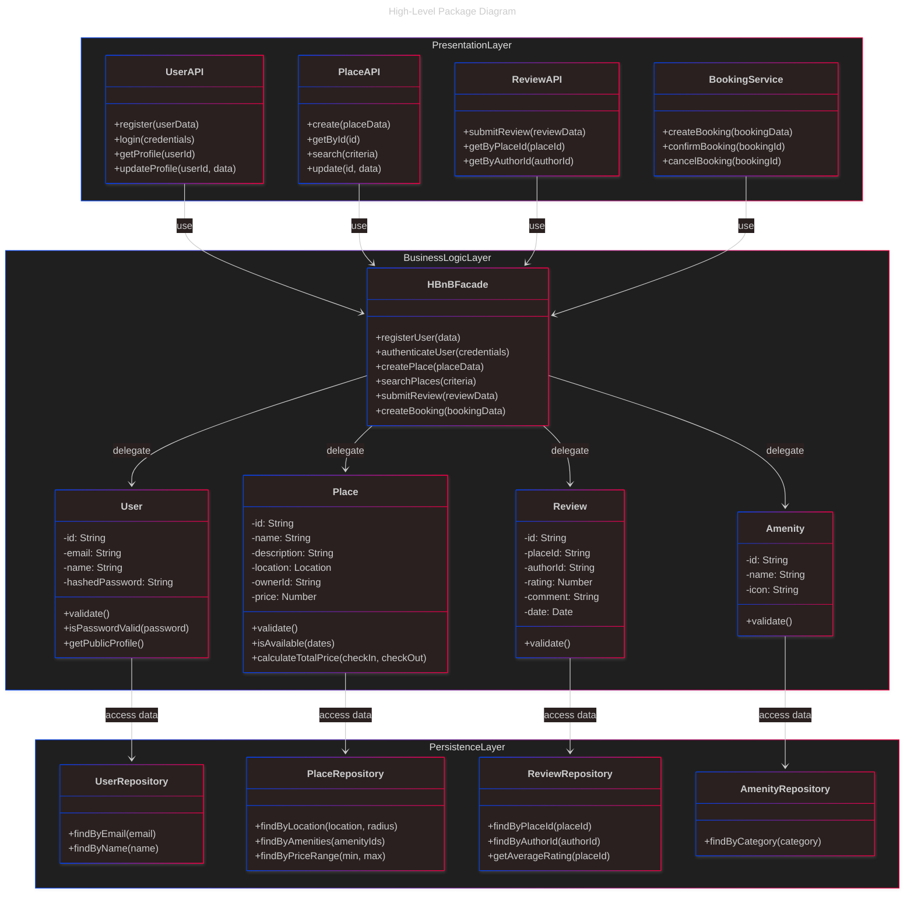
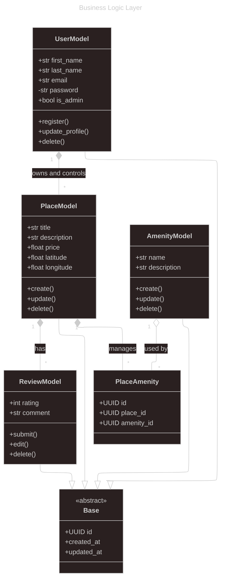
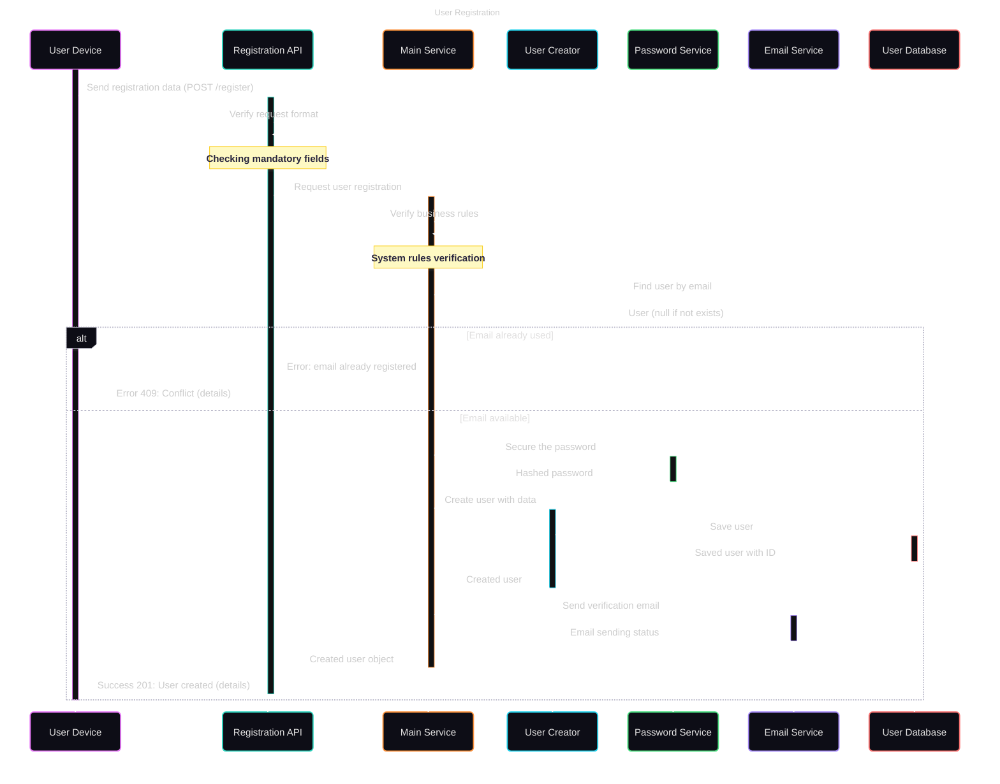

# HBnB Project – Technical Documentation

## 1. Introduction

Ce document technique présente l’architecture du projet **HBnB**, une plateforme de location de logements inspirée d’Airbnb.

Il regroupe l’ensemble des diagrammes UML créés lors des étapes de conception :
- Le **diagramme de packages** (architecture en couches),
- Le **diagramme de classes métier** (Business Logic Layer),
- Les **diagrammes de séquence** illustrant le flux des appels API.

Ce document sert de **référence technique** pour les phases de développement, garantissant clarté, cohérence et maintenabilité du système.

---

## 2. High-Level Architecture

### 2.1 Diagramme de packages

### 2.2 Description de l’architecture en couches

Le système est basé sur une architecture en couches :

- **Couche API (Interface)** : gère les requêtes REST, agit comme façade.
- **Couche Logique Métier** : contient les règles métier (création d’utilisateurs, d’avis, etc.)
- **Couche de Stockage** : interaction avec les fichiers ou la base de données.

Cette séparation permet une bonne **modularité**, **testabilité** et **maintenabilité** du code.

---

## 3. Business Logic Layer

### 3.1 Diagramme de classes métier

### 3.2 Description des entités et relations

#### 🔸 Base
Classe abstraite commune, fournit : `id`, `created_at`, `updated_at`.

#### 🔸 User
Représente un utilisateur :
- Attributs : `first_name`, `last_name`, `email`, `is_admin`, etc.
- Méthodes : `register()`, `delete()`, etc.
- Hérite de `Base`.
- **Composition** avec `Place` : un `User` possède ses `Place`.

#### 🔸 Place
Représente un logement publié :
- Attributs : `title`, `price`, `latitude`, etc.
- Méthodes : `create()`, `update()`, etc.
- Composé dans `User`, agrège des `Review`.

#### 🔸 Review
Représente un avis :
- Attributs : `rating`, `comment`
- Méthodes : `submit()`, `edit()`
- Lié à `User` et `Place` via associations simples

#### 🔸 Amenity
Représente un équipement (Wi-Fi, etc.)
- Associé via `PlaceAmenity`
- Vit indépendamment des `Place`

#### 🔸 PlaceAmenity
Table d’association entre `Place` et `Amenity`
- **Composé dans `Place`**
- **Agrégé par `Amenity`**

---

## 4. API Interaction Flow

### 4.1 Diagrammes de séquence

Exemples recommandés :
- Création d’un `Place` par un utilisateur
- Écriture d’un `Review`
- Suppression d’un compte utilisateur

### 4.2 Explication des scénarios

#### Exemple : Écriture d’un avis

1. L’utilisateur authentifié soumet un avis via l’API.
2. L’API valide l’authentification et le format.
3. Le `Review` est créé dans la couche métier.
4. Le `Review` est lié à l’utilisateur et au logement.
5. L’objet est sauvegardé en base.

---

## 5. Conclusion *(optionnel)*

Ce document constitue la **base de référence** technique du projet HBnB.  
Il permet de guider la mise en œuvre du système en respectant les règles métier, les interactions entre couches et les contraintes de conception.

---

## 📎 Annexes *(optionnel)*

- Liens vers les sources (guides UML, style guides)
- Références du projet ou outils utilisés (Mermaid, PlantUML, etc.)
