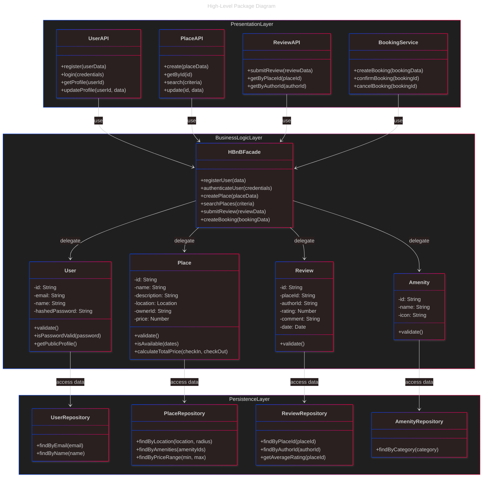
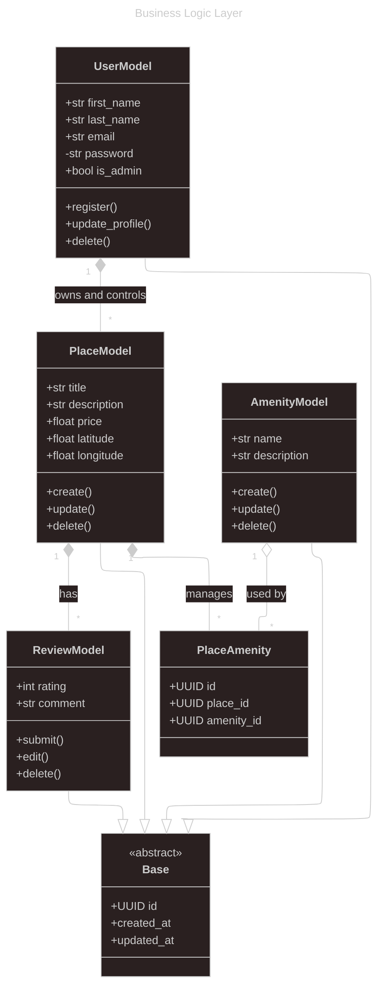
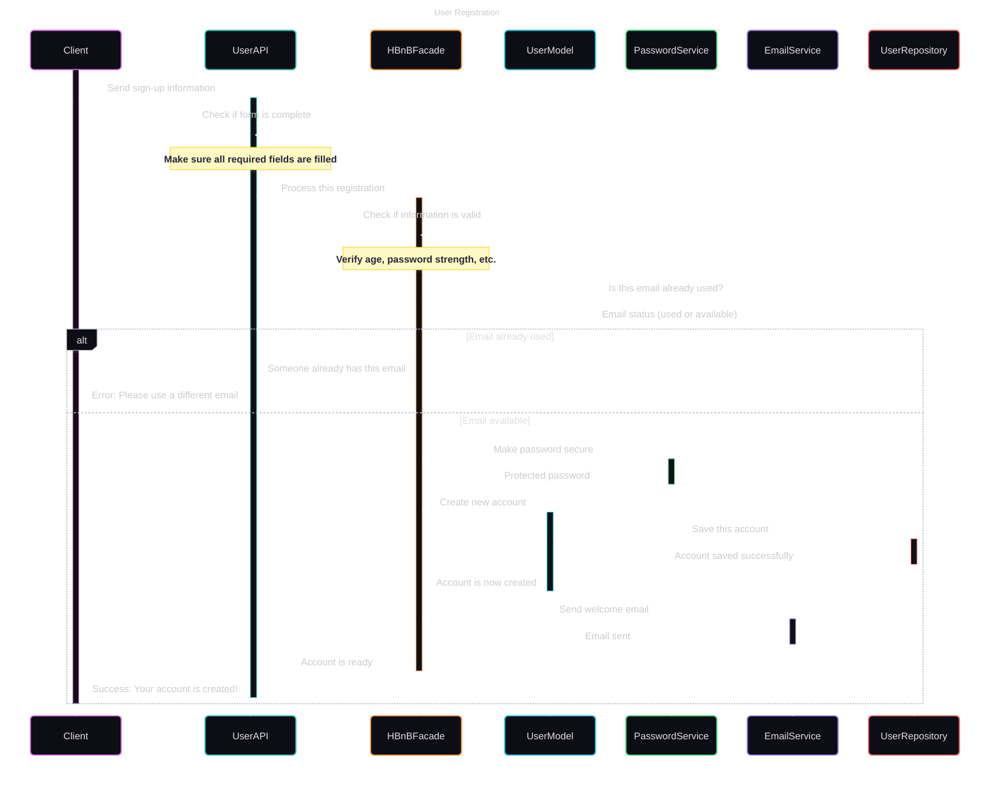
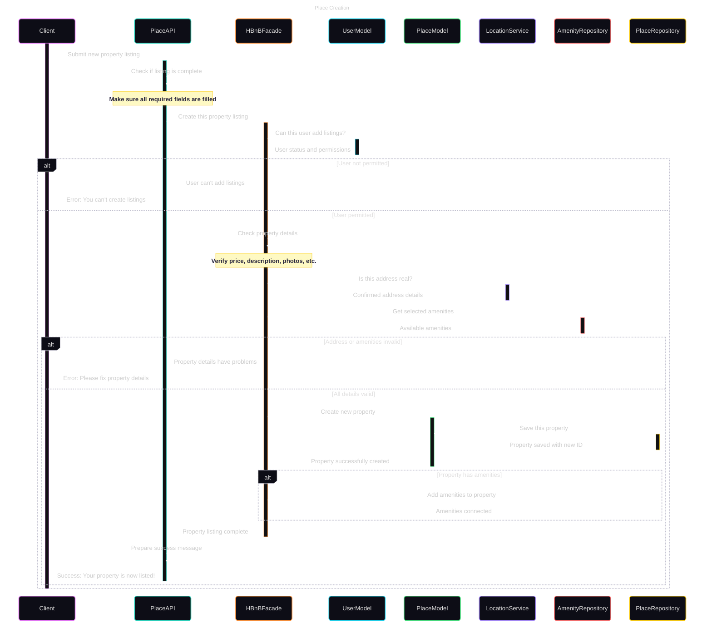
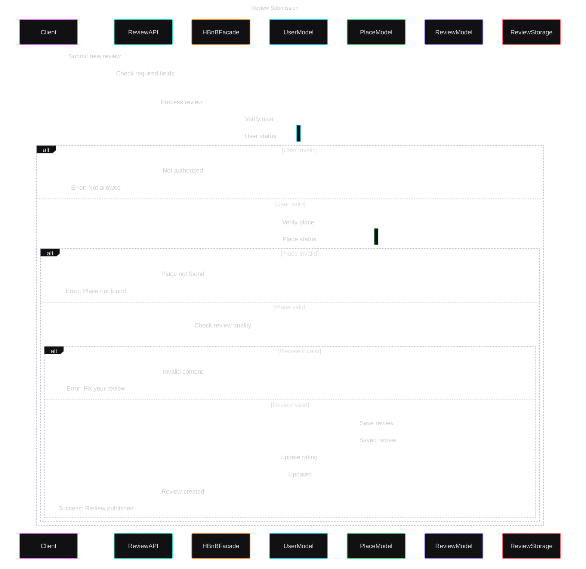

# HBnB Project – Technical Documentation

## 1. Introduction

This technical document presents the architecture of the **HBnB** project, a housing rental platform inspired by Airbnb.

It brings together all the UML diagrams created during the design phases:
- The **package diagram** (layered architecture),
- The **business class diagram** (Business Logic Layer),
- The **sequence diagrams** illustrating API call flows.

This document serves as a **technical reference** for the development phases, ensuring clarity, consistency, and maintainability of the system.

---

## 2. High-Level Architecture

### 2.1 Package Diagram



### 2.2 Description of the Layered Architecture

The system is based on a layered architecture:

- **API Layer (Interface)**: handles REST requests, acts as a facade.
- **Business Logic Layer**: contains business rules (user creation, reviews, etc.)
- **Storage Layer**: interaction with files or database.

This separation allows for good **modularity**, **testability**, and **maintainability** of the code.

### 2.3 Detailed Package Diagram Analysis

The package diagram illustrates the three-tier architecture of the HBnB system, designed with clear separation of concerns:

1. **Presentation Layer (PresentationLayer)**:
   - Functions as the external interface for all client interactions through standardized REST APIs
   - `UserAPI` handles the complete user lifecycle (registration, authentication, profile management)
   - `PlaceAPI` centralizes all accommodation operations (listing creation, search with complex criteria, updates)
   - `ReviewAPI` manages the entire review process (submission, retrieval, filtering)
   - `BookingService` orchestrates the booking workflow from request to confirmation or cancellation
   - This layer validates input data format but delegates business rule validation to lower layers

2. **Business Logic Layer (BusinessLogicLayer)**:
   - Implements the Facade pattern through `HBnBFacade`, providing a simplified interface to complex subsystems
   - Contains domain entities with encapsulated business rules:
     - `User`: handles authentication logic, password policies, and profile validation
     - `Place`: manages pricing rules, availability calculations, and listing requirements
     - `Review`: enforces rating guidelines and content policies
     - `Amenity`: standardizes facility categorization and representation
   - Business logic is isolated from both presentation concerns and data persistence implementation

3. **Persistence Layer (PersistenceLayer)**:
   - Implements the Repository pattern to abstract data access operations
   - Each repository specializes in data operations for a specific entity type:
     - `UserRepository`: handles user credential verification and profile retrieval
     - `PlaceRepository`: supports complex geographical and feature-based queries
     - `ReviewRepository`: manages aggregations like average ratings and filtering
     - `AmenityRepository`: enables categorization and classification of amenities
   - This layer can be adapted to different storage solutions (SQL/NoSQL databases, file systems) without affecting upper layers

The architecture follows key design principles:
- **Dependency Inversion**: Higher layers depend on abstractions, not implementations
- **Single Responsibility**: Each component has a focused, well-defined purpose
- **Interface Segregation**: APIs are tailored to specific client needs
- **Open/Closed**: The system can be extended without modifying existing code

This structured approach enables independent development, comprehensive testing, and easier maintenance as the system evolves.


---

## 3. Business Logic Layer

### 3.1 Business Class Diagram



### 3.2 Description of Entities and Relationships

#### 🔸 Base
Common abstract class, provides: `id`, `created_at`, `updated_at`.

#### 🔸 User
Represents a user:
- Attributes: `first_name`, `last_name`, `email`, `is_admin`, etc.
- Methods: `register()`, `delete()`, etc.
- Inherits from `Base`.
- **Composition** with `Place`: a `User` owns their `Place`.

#### 🔸 Place
Represents a published accommodation:
- Attributes: `title`, `price`, `latitude`, etc.
- Methods: `create()`, `update()`, etc.
- Composed in `User`, aggregates `Review`.

#### 🔸 Review
Represents a review:
- Attributes: `rating`, `comment`
- Methods: `submit()`, `edit()`
- Linked to `User` and `Place` via simple associations

#### 🔸 Amenity
Represents a facility (Wi-Fi, etc.)
- Associated via `PlaceAmenity`
- Exists independently of `Place`

#### 🔸 PlaceAmenity
Association table between `Place` and `Amenity`
- **Composed in `Place`**
- **Aggregated by `Amenity`**

### 3.3 In-Depth Business Class Diagram Analysis

The business class diagram reveals the domain model structure and relationships with these key elements:

1. **Abstract `Base` Class**:
   - Serves as the foundation for all persistent entities in the system
   - Implements the concept of entity identity through UUID generation
   - Provides automatic temporal tracking (`created_at`, `updated_at`) for audit trails
   - Creates a consistent interface for common operations across all derived classes
   - Standardizes serialization/deserialization behaviors for all model objects

2. **Entity Relationships and Semantics**:
   - **Composition relationship** (`*--`) between `UserModel` and `PlaceModel`:
     - Indicates strong ownership and lifecycle dependency
     - When a user is deleted, all their places are automatically removed
     - A place cannot exist independently of its owner
   
   - **Composition relationship** between `PlaceModel` and `ReviewModel`:
     - Reviews are dependent on the existence of their associated place
     - Deletion of a place cascades to removal of all its reviews
   
   - **Aggregation relationship** (`o--`) between `AmenityModel` and `PlaceAmenity`:
     - Amenities exist independently of any specific place
     - The same amenity can be associated with multiple places
     - Deleting a place doesn't affect the amenity itself, only the association

   - **Multiplicities** provide important cardinality constraints:
     - "1" to "*" between User and Place: a user can own multiple places
     - "1" to "*" between Place and Review: a place can have multiple reviews
     - "1" to "*" between Amenity/Place and PlaceAmenity: implements many-to-many relationship

3. **Attribute Visibility and Encapsulation**:
   - **Public attributes** (`+`): Accessible throughout the system
     - Used for attributes that need wide visibility for business operations
   
   - **Private attributes** (`-`): Internal to their containing class
     - Protects sensitive data (e.g., `password` in `UserModel`) from unauthorized access
     - Forces access through controlled methods that can apply validation and business rules
   
   - **Methods** implement behavior specific to each entity type:
     - CRUD operations (`create()`, `update()`, `delete()`)
     - Business validations (`validate()`)
     - Entity-specific operations (`register()` for users, `submit()` for reviews)

This domain model structure enables:
- Precise representation of business concepts and relationships
- Data integrity through relationship constraints
- Security through proper encapsulation
- Clear separation between data structure and behavior

---

## 4. API Interaction Flow

### 4.1 Sequence Diagrams





```mermaid
---
config:
  theme: redux-dark-color
  look: neo
title: Fetching a List of Places
---
sequenceDiagram
    participant Client
    participant PlaceAPI
    participant HBnBFacade
    participant SearchService
    participant PlaceRepository
    participant AmenityRepository
    
    activate Client
    Client->>+PlaceAPI: GET /places (search criteria)
    activate PlaceAPI
    Note over Client,PlaceAPI: Location, price, amenities, dates
    
    PlaceAPI->>PlaceAPI: Validate search parameters
    PlaceAPI->>+HBnBFacade: searchPlaces(filters)
    activate HBnBFacade
    
    HBnBFacade->>+SearchService: processSearch(searchCriteria)
    activate SearchService
    SearchService->>SearchService: Optimize search query
    Note over SearchService: Convert location to coordinates, normalize filters
    
    alt Location and amenities specified
        SearchService->>+AmenityRepository: getAmenityIds(amenityNames)
        AmenityRepository-->>-SearchService: List of amenity IDs
        
        SearchService->>+PlaceRepository: findByLocationAndAmenities(...)
        PlaceRepository-->>-SearchService: Filtered properties
    else Other search criteria
        SearchService->>+PlaceRepository: findByFilters(processedFilters)
        PlaceRepository-->>-SearchService: Matching properties
    end
    
    SearchService->>SearchService: Apply additional filters
    Note over SearchService: Handle price range, dates, etc.
    
    SearchService-->>-HBnBFacade: Filtered search results
    
    HBnBFacade->>HBnBFacade: Sort and paginate results
    Note over HBnBFacade: Order by relevance and limit results per page
    
    HBnBFacade->>HBnBFacade: Prepare place details
    Note over HBnBFacade: Format for public view
    
    HBnBFacade-->>-PlaceAPI: searchResults object
    
    PlaceAPI->>PlaceAPI: Format response
    PlaceAPI-->>-Client: 200 OK (places list with details)
    deactivate Client
    ```

Recommended examples:
- Creation of a `Place` by a user
- Writing a `Review`
- Deletion of a user account

### 4.2 Explanation of Scenarios

#### Example: Writing a review

1. The authenticated user submits a review via the API.
2. The API validates authentication and format.
3. The `Review` is created in the business layer.
4. The `Review` is linked to the user and accommodation.
5. The object is saved in the database.

### 4.3 Detailed Sequence Diagram Analysis

The sequence diagrams illustrate the runtime behavior of key system operations:

#### User Registration Sequence

1. **Request Processing and Validation**:
   - The flow begins with client input and proceeds through multiple validation layers
   - Initial validation in `UserAPI` checks basic request format requirements
   - Business validation in `HBnBFacade` enforces rules like password strength and age requirements
   - Existing email check demonstrates proper validation before attempting resource creation

2. **Error Handling Strategy**:
   - The diagram shows comprehensive error handling with different response codes
   - Error messages include specific details to guide the client
   - Each error is detected at the appropriate layer and propagated upward
   - This approach demonstrates the system's robustness against invalid inputs

3. **Security and Support Services**:
   - `PasswordService` shows proper security practices for credential handling:
     - Password hashing occurs before storage
     - Original passwords never persist in the system
   - `EmailService` demonstrates integration with external notification systems
   - Both services are properly abstracted behind interfaces for testability

#### Place Creation Sequence

1. **Authorization and Validation Hierarchy**:
   - Demonstrates multi-level validation strategy:
     - Format validation at API layer
     - Permission checking through user verification
     - Business rule validation for place properties
     - External validation through location service
   - Each validation occurs at the appropriate architectural layer

2. **Complex Entity Creation Process**:
   - Shows how creating a place involves multiple components and steps
   - Illustrates verification of reference entities (amenities)
   - Demonstrates proper handling of related entities
   - Models a realistic business process with appropriate complexity

3. **Transactional Integrity**:
   - The diagram shows how the system maintains consistency:
     - Place creation with amenities is handled as an atomic operation
     - Failure at any step results in complete operation failure
     - No partial updates are committed to the database
   - This approach prevents data inconsistencies in the system

#### Review Submission Sequence

1. **Multi-entity Verification**:
   - The process validates both the user submitting the review and the place being reviewed
   - Shows how relationships between entities are verified before allowing operations
   - Demonstrates proper access control based on user identity

2. **Content Quality Control**:
   - Illustrates validation of review content quality (rating range, comment length)
   - Shows how business rules are applied to maintain data quality
   - Demonstrates rejection of substandard content with appropriate feedback

3. **Cascading Updates**:
   - Shows how a single review submission triggers updates to related entities
   - The place's average rating is recalculated after review submission
   - Demonstrates maintenance of derived data for performance optimization

These sequence diagrams serve as:
- Executable specifications for developers
- Documentation for cross-team collaboration
- Verification tools for architecture compliance
- Reference for testing scenarios and edge cases

---

## 5. Conclusion

This document constitutes the **technical reference base** for the HBnB project.  
It guides the implementation of the system while respecting business rules, interactions between layers, and design constraints.

---

## 📎 Appendices

### UML and Design Resources
- [UML Specification](https://www.omg.org/spec/UML/)
- [Mermaid JS Documentation](https://mermaid-js.github.io/mermaid/#/)
- [Design Patterns in Software Engineering](https://refactoring.guru/design-patterns)

### Architecture References
- [The Clean Architecture by Robert C. Martin](https://blog.cleancoder.com/uncle-bob/2012/08/13/the-clean-architecture.html)
- [Domain-Driven Design by Eric Evans](https://domainlanguage.com/ddd/)
- [Microservices Patterns by Chris Richardson](https://microservices.io/patterns/index.html)

### Development Standards
- [RESTful API Design Best Practices](https://restfulapi.net/)
- [SOLID Principles](https://en.wikipedia.org/wiki/SOLID)
- [Test-Driven Development Methodology](https://www.agilealliance.org/glossary/tdd/)