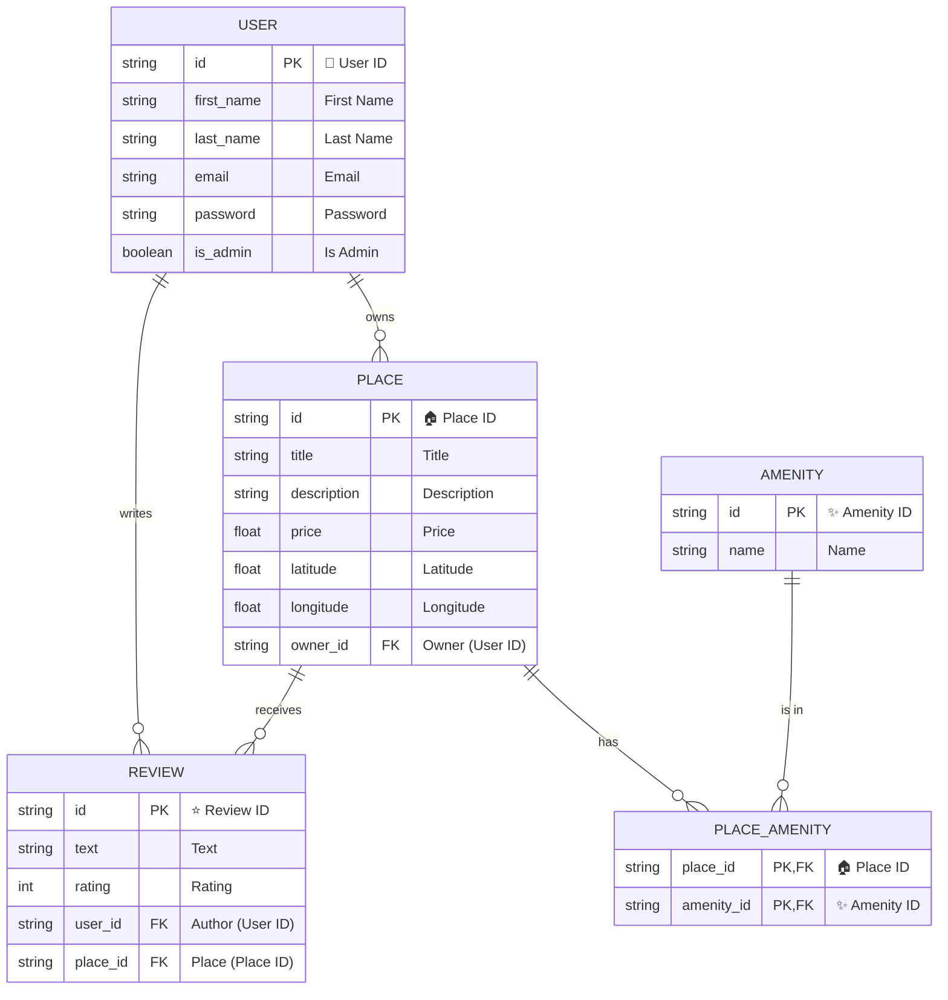

# HBnB - Holberton BnB (Part 3)

## About the project

HBnB (Holberton BnB) est une application de location de logements inspirée d’Airbnb.  
Cette troisième partie introduit une architecture professionnelle :  
- **API RESTful** complète (Flask-RESTx)
- **Authentification JWT**
- **RBAC** (admin/user)
- **CRUD** pour users, places, amenities, reviews
- **Gestion des droits** (admin only, ownership)
- **Validation et gestion d’erreurs robuste**
- **Scripts SQL** pour la base et les données initiales

## Architecture

- **API Layer** : Flask-RESTx, endpoints versionnés, Swagger UI
- **Business Logic Layer** : Facade (HBnBFacade), centralisation des règles métier
- **Model Layer** : SQLAlchemy, validation forte, relations ORM
- **Persistence Layer** : Repository pattern (SQLAlchemyRepository)
- **Tests** : Unittests et intégration (pytest)

## Main Features

- **RBAC** : Seul l’admin peut créer des users, gérer les amenities, bypasser l’ownership
- **JWT** : Authentification sécurisée, endpoints protégés
- **CRUD** : Complet sur users, places, amenities, reviews
- **Gestion des erreurs** : Statuts HTTP cohérents, messages explicites
- **SQL** : Scripts pour créer, peupler et tester la base
- **Logs** : Pour le debug et la traçabilité

## Database Schema (ER Diagram)



## API Endpoints

- `POST /api/v1/users` : Création d’utilisateur (admin only)
- `POST /api/v1/auth/login` : Authentification, obtention du JWT
- `GET/POST/PUT/DELETE /api/v1/places` : CRUD sur les hébergements
- `GET/POST/PUT/DELETE /api/v1/amenities` : CRUD sur les équipements (admin only pour POST/PUT)
- `GET/POST/PUT/DELETE /api/v1/reviews` : CRUD sur les avis
- `GET /api/v1/places/{id}/reviews` : Avis d’un hébergement

## Usage

### Installation

```bash
git clone https://github.com/your-username/holbertonschool-hbnb.git
cd holbertonschool-hbnb/part3/hbnb
python3 -m venv venv
source venv/bin/activate
pip install -r requirements.txt
```

### Initialisation de la base

```bash
sqlite3 instance/development.db < SQL_scripts/create_tables.sql
sqlite3 instance/development.db < SQL_scripts/insert_data.sql
```

### Lancement

```bash
python run.py
```

Swagger UI : http://127.0.0.1:5000/

### Tests

```bash
pytest
```

## Points forts de la part3

- **Sécurité** : JWT, RBAC, validation stricte
- **Modularité** : architecture en couches, patterns professionnels
- **SQL** : scripts reproductibles, cohérence ORM/SQL
- **Extensibilité** : facile d’ajouter de nouveaux endpoints ou entités
- **Documentation** : Swagger, README, diagramme Mermaid

## Authors

- **Stéphane Paton**
- **Guillaume Font**

---
