# HBnB - Holberton BnB (Part 3)

## About the Project

HBnB (Holberton BnB) is a lodging rental application inspired by Airbnb.  
This third part introduces a professional architecture and advanced features:
- **Full RESTful API** (Flask-RESTx)
- **JWT Authentication**
- **RBAC** (admin/user)
- **Complete CRUD** for users, places, amenities, reviews
- **Ownership and admin rights management**
- **Robust validation and error handling**
- **SQL scripts** for schema and initial data

## Architecture

- **API Layer**: Flask-RESTx, versioned endpoints, Swagger UI
- **Business Logic Layer**: Facade (HBnBFacade), centralizes business rules
- **Model Layer**: SQLAlchemy, strong validation, ORM relationships
- **Persistence Layer**: Repository pattern (SQLAlchemyRepository)
- **Testing**: Unittests and integration (pytest)

### Project Structure

```
hbnb/
├── app/
│   ├── __init__.py
│   ├── api/
│   │   ├── __init__.py
│   │   └── v1/
│   │       ├── __init__.py
│   │       ├── users.py         # User endpoints (RBAC, JWT)
│   │       ├── places.py        # Place endpoints (ownership, amenities)
│   │       ├── amenities.py     # Amenity endpoints (admin only for POST/PUT)
│   │       ├── reviews.py       # Review endpoints
│   │       └── views/           # (optional) extra views
│   ├── models/
│   │   ├── __init__.py
│   │   ├── user.py
│   │   ├── place.py
│   │   ├── amenity.py
│   │   ├── review.py
│   │   └── base_model.py
│   ├── persistence/
│   │   ├── __init__.py
│   │   └── repository.py        # Repository pattern (SQLAlchemyRepository)
│   └── services/
│       ├── __init__.py
│       └── facade.py            # Facade (business logic, RBAC, validation)
├── SQL_scripts/
│   ├── create_tables.sql
│   ├── insert_data.sql
│   └── test_crud.sql
├── instance/
│   └── development.db           # SQLite DB (ignored in git)
├── tests/
│   └── models/
│       ├── test_user.py
│       ├── test_place.py
│       ├── test_amenity.py
│       └── test_review.py
├── config.py
├── requirements.txt
└── run.py
```

## RBAC Matrix

| Endpoint                  | Admin         | User          | Not Authenticated |
|---------------------------|:-------------:|:-------------:|:-----------------:|
| POST   /users             | ✅            | ❌            | ❌                |
| GET    /users             | ✅            | ✅ (self only) | ❌                |
| PUT    /users/{id}        | ✅ (any)      | ✅ (self only) | ❌                |
| POST   /places            | ✅            | ✅            | ❌                |
| PUT    /places/{id}       | ✅ (any)      | ✅ (owner)     | ❌                |
| DELETE /places/{id}       | ✅ (any)      | ✅ (owner)     | ❌                |
| POST   /amenities         | ✅            | ❌            | ❌                |
| PUT    /amenities/{id}    | ✅            | ❌            | ❌                |
| GET    /amenities         | ✅            | ✅            | ✅                |
| POST   /reviews           | ✅            | ✅            | ❌                |
| PUT    /reviews/{id}      | ✅ (any)      | ✅ (author)    | ❌                |
| DELETE /reviews/{id}      | ✅ (any)      | ✅ (author)    | ❌                |

- **Admin**: can do everything, including bypassing ownership checks.
- **User**: can only manage their own resources (places, reviews).
- **Not Authenticated**: can only access public GET endpoints.

## Database Schema (ER Diagram)

```mermaid
erDiagram
    USER {
        string id PK "🧑 User ID"
        string first_name "First Name"
        string last_name "Last Name"
        string email "Email"
        string password "Password"
        boolean is_admin "Is Admin"
    }
    PLACE {
        string id PK "🏠 Place ID"
        string title "Title"
        string description "Description"
        float price "Price"
        float latitude "Latitude"
        float longitude "Longitude"
        string owner_id FK "Owner (User ID)"
    }
    AMENITY {
        string id PK "✨ Amenity ID"
        string name "Name"
    }
    REVIEW {
        string id PK "⭐ Review ID"
        string text "Text"
        int rating "Rating"
        string user_id FK "Author (User ID)"
        string place_id FK "Place (Place ID)"
    }
    PLACE_AMENITY {
        string place_id PK, FK "🏠 Place ID"
        string amenity_id PK, FK "✨ Amenity ID"
    }

    %% Relations
    USER ||--o{ PLACE : "owns"
    USER ||--o{ REVIEW : "writes"
    PLACE ||--o{ REVIEW : "receives"
    PLACE ||--o{ PLACE_AMENITY : "has"
    AMENITY ||--o{ PLACE_AMENITY : "is in"
```



## API Endpoints

- `POST /api/v1/users`: Create user (admin only)
- `POST /api/v1/auth/login`: Authenticate, get JWT
- `GET/POST/PUT/DELETE /api/v1/places`: CRUD for places
- `GET/POST/PUT/DELETE /api/v1/amenities`: CRUD for amenities (admin only for POST/PUT)
- `GET/POST/PUT/DELETE /api/v1/reviews`: CRUD for reviews
- `GET /api/v1/places/{id}/reviews`: Get reviews for a place

## Usage

### Installation

```bash
git clone https://github.com/your-username/holbertonschool-hbnb.git
cd holbertonschool-hbnb/part3/hbnb
python3 -m venv venv
source venv/bin/activate
pip install -r requirements.txt
```

### Database Initialization

```bash
sqlite3 instance/development.db < SQL_scripts/create_tables.sql
sqlite3 instance/development.db < SQL_scripts/insert_data.sql
```

### Running the Server

```bash
python run.py
```

Swagger UI: http://127.0.0.1:5000/

### Tests

```bash
pytest
```

## Key Strengths of Part 3

- **Security**: JWT, RBAC, strict validation
- **Modularity**: Layered architecture, professional design patterns
- **SQL**: Reproducible scripts, ORM/SQL consistency
- **Extensibility**: Easy to add new endpoints or entities
- **Documentation**: Swagger, README, Mermaid diagram

## Technical Challenges & Solutions

- **Circular imports**: Resolved by moving imports inside methods or constructors.
- **Backref conflicts**: Fixed by using explicit foreign keys and removing ambiguous backrefs.
- **RBAC enforcement**: JWT claims and endpoint protection for admin/user logic.
- **Ownership logic**: Explicit checks in endpoints and service layer.
- **Database consistency**: Strict sync between SQL schema and ORM models.
- **Amenity management**: Custom `add_amenity` method and session management.
- **Error handling**: Consistent error messages, HTTP codes, and logging.

## Testing Strategy

- **Unit tests**: All models and business logic are covered with pytest.
- **Integration tests**: Endpoints are tested for all CRUD operations and RBAC scenarios.
- **Manual tests with curl**:  
  - Authentication:  
    ```bash
    curl -X POST http://localhost:5000/api/v1/auth/login -d '{"email":"admin@hbnb.io","password":"admin123"}' -H "Content-Type: application/json"
    ```
  - Create a user (admin only):  
    ```bash
    curl -X POST http://localhost:5000/api/v1/users -H "Authorization: Bearer <ADMIN_TOKEN>" -d '{"first_name":"Test","last_name":"User","email":"test@hbnb.io","password":"test123"}' -H "Content-Type: application/json"
    ```
  - Create a place (user):  
    ```bash
    curl -X POST http://localhost:5000/api/v1/places -H "Authorization: Bearer <USER_TOKEN>" -d '{"title":"Studio","description":"Nice","price":50,"latitude":48.8,"longitude":2.3}' -H "Content-Type: application/json"
    ```
  - Test forbidden actions (user trying to create another user, etc.)
  - Test error cases (missing fields, invalid JWT, etc.)

## Authors

- **Stéphane Paton**
- **Guillaume Font**
